= Google Cloud Platform - IoT Demo

:Author:    Patrick Steiner
:Email:     patrick@steiner-buchholz.de
:Date:      30.12.2017

:toc: macro

toc::[]

== Purpose
In this demo we will take a look at a sample way of doing IoT like tasks,
mainly using the capabilities provided by https://cloud.google.com[Google Cloud Platform].

In this case we will make use of

 * https://cloud.google.com/iot-core/[Goolge Cloud IoT Core]
 * https://cloud.google.com/pubsub/[Goolge Cloud PubSub]
 * https://cloud.google.com/dataflow/[Goolge Cloud Dataflow]
 * https://cloud.google.com/bigquery/[Goolge BigQuery]

For the Device-Layer of this demo, we will make use of an ESP8266 microcontroller
with a DHT22 to measure temperature and humidity.

== Building a Sensor
For this demo project, I will be using a https://en.wikipedia.org/wiki/NodeMCU[NodeMCU based on ESP8266]
combined with a DHT22 sensor.

I have wired the NodeMCU and DHT22 based on the following image

image::pictures/breadboard.png[]

To program the NodeMCU, I made use of https://mongoose-os.com/[Mongoose OS] a new system, which I was not aware of
for my previous experiments. Up to now I'm not certain if this is an advantage
to my previous method, as describe in a earlier https://github.com/PatrickSteiner/IoT_Sensor_Labs[project].
Time will tell!

[NOTE]
====
You will have to connect your NodeMCU to your computer via an USB cable.
I have seen people use some cheap USB cable that was only designed to charge
hardware and was missing the data-wires. So please make sure to use a proper
cable.
====

=== Install Mongoose OS
Please install Mongoose OS based on the description provided by https://mongoose-os.com/software.html[Mongoose OS].

=== Start Mongoose OS
Start Mongoose OS based on the instructions provided by them.

In my case I needed to run the following command from a Command-Line

```
psteiner$ ~/.mos/bin/mos
```

Your browser should start with the Mongoose OS User-Interface

image::pictures/start_mongoose.png[]

=== Flash ESP8266

Select the proper Port for your NodeMCU and connect Mongoose OS with your NodeMCU.

image::pictures/connect_mongoose.png[]

You can flash sample code to your ESP8266. Please do so, as we will be
extending the sample code to do our bidding.

image::pictures/flash_esp.png[]

I will use the NodeJS based sample, but you can use the "C" demo as well.

Last thing to do is to connect the ESP8266 with your WiFi.

image::pictures/wifi_esp.png[]

With the newly flashed firmware on the ESP8266 and the WiFi configured,
you should see log-messages including your WiFi connection

```
[Dec 30 19:49:36.037] mgos_wifi_setup_sta  WiFi STA: Connecting to Steiner
```

as well as the ESP8266 creating and logging data

```
[Dec 30 19:52:06.776] Tick uptime: 150.851430 {"free_ram":36100,"total_ram":52032}
[Dec 30 19:52:07.776] Tock uptime: 151.851113 {"free_ram":36100,"total_ram":52032}
[Dec 30 19:52:08.776] Tick uptime: 152.851563 {"free_ram":36100,"total_ram":52032}
```

There is more features in the flashed code, but that is for you to discover!

=== Changing the Demo Code
As this demo is not about teaching NodeJS or ESP8266 programming, we will
look into the basics of handling the Mongoose OS Web-UI.

To do this, we will stop the Blinking of the ESP8266 LED.

Make sure you are looking at the file `fs/index.js`

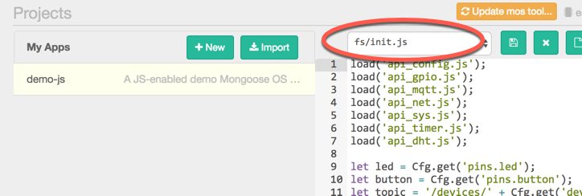

Find the following code segment and remove or comment it out

```
GPIO.set_mode(led, GPIO.MODE_OUTPUT);
...
let value = GPIO.toggle(led);
```

you will also have to adjust the following line, as `value` doesn't exist
anymore.

```
print(value ? 'Tick' : 'Tock', 'uptime:', Sys.uptime(), getInfo());
```

There are more lines of code covering the Blink-LED, but for this intro
exercise, this should suffice.

After having changed the code, we obviously have to safe it.

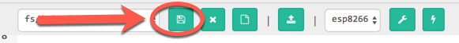

There are two options to update the code on the ESP8266, a slow and a faster one.

Let's look at the faster one together, so you can find the other one yourself.

All you need to do is to upload the updated code to the ESP8266

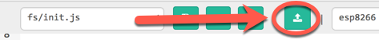

In the Log-Window of Mongoose OS Web-UI you see the updated File being uploaded,
and the ESP8266 being rebooted to start the new firmware.

=== Update ESP8266 Sample code
I have provided you with updates to the two needed source-files

 * https://github.com/PatrickSteiner/Google_Cloud_IoT_Demo/blob/master/firmware/fs/init.js[fs/index.js]
 * https://github.com/PatrickSteiner/Google_Cloud_IoT_Demo/blob/master/firmware/mos.yml[mos.yml]

they are updates to the ones from the sample and are extended by code needed
to read the data from the DHT22 sensor and output this instead of `free_ram` and
`total_ram`.

=== Configure Google cloud
Up until now the ESP8266 was programmed to send a jSON based message via MQTT
to a MQTT-Broker, which didn't exist.

We will be using capbilities provided by https://cloud.google.com[Google Cloud Platform] to provided

* https://cloud.google.com/iot-core/[Goolge Cloud IoT Core]

> Cloud IoT Core is a fully managed service that allows you to easily and securely connect, manage, and ingest data from millions of globally dispersed devices. Cloud IoT Core, in combination with other services on Google Cloud IoT platform, provides a complete solution for collecting, processing, analyzing, and visualizing IoT data in real time to support improved operational efficiency.

* https://cloud.google.com/pubsub/[Goolge Cloud PubSub]

> Cloud Pub/Sub is a simple, reliable, scalable foundation for stream analytics and event-driven computing systems. As part of Google Cloud’s stream analytics solution, the service ingests event streams and delivers them to Cloud Dataflow for processing and BigQuery for analysis as a data warehousing solution.

To be able to use https://cloud.google.com[Google Cloud Platform], you will have to
perform a few installation and configuration steps.

* Install `gcloud` command for https://cloud.google.com[Google Cloud Platform], based
on https://cloud.google.com/sdk/downloads[instructions provided by Google].
* Install some Beta Features via
```
$ gcloud components install beta
```
* Login to Google Cloud and authenticate yourself
```
$ gcloud auth login
```
* Create a project in Google Cloud
```
$ gcloud projects create YOUR_PROJECT_NAME
```
* Make the newly created project to your current project
```
$ gcloud config set project YOUR_PROJECT_NAME
```
To be able to make proper use of the Google Cloud features, we need to enable *billing* for the
newly created project. To do so go to https://console.developers.google.com/project/<YOUR_PROJECT_NAME>/settings
and link the project with your account.

The above steps created a generic project in https://cloud.google.com[Google Cloud Platform]. The following
steps will create needed artifacts for https://cloud.google.com/iot-core/[Goolge Cloud IoT Core] and https://cloud.google.com/pubsub/[Goolge Cloud PubSub]

* Allow IoT Core to publish messages in PubSub
```
$ gcloud projects add-iam-policy-binding YOUR_PROJECT_NAME --member=serviceAccount:cloud-iot@system.gserviceaccount.com --role=roles/pubsub.publisher
```
* Create a MQTT Topic in PubSub
```
$ gcloud beta pubsub topics create iot-topic
```
* We can also create a subscription to read messages from a topic. This is not needed at this stage, as we will be sending messages from EPS8266 only, but
at a later stage.
```
$ gcloud beta pubsub subscriptions create --topic iot-topic iot-subscription
```
* Create a device registry in https://cloud.google.com/iot-core/[Goolge Cloud IoT Core] to manage
devices.
```
$ gcloud beta iot registries create iot-registry --region europe-west1 --event-pubsub-topic=iot-topic
```

You can verify the above configuration steps by using the https://cloud.google.com[Google Cloud Platform] Web UI

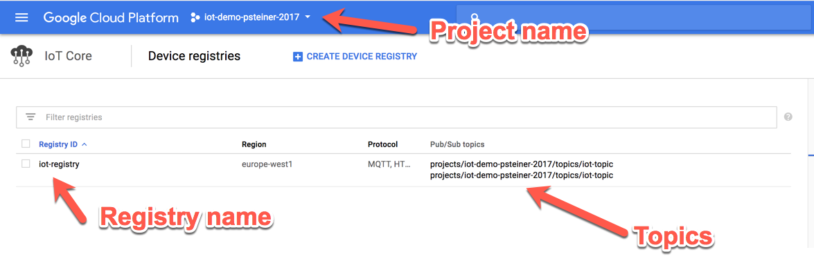

=== Connect ESP8266 to Google cloud
If you have followed me so far, you have an ESP8266 and something in https://cloud.google.com[Google Cloud Platform].
Let's connect these two!

As mentioned earlier, the ESP8266 is already prepared to send MQTT messages to a
MQTT-Broker, so all we need to do is to make the ESP8266 aware of https://cloud.google.com[Google Cloud Platform] and
our artifacts there. To do this, you will have to go into the `Terminal` part of
the Mongoose OS Web UI

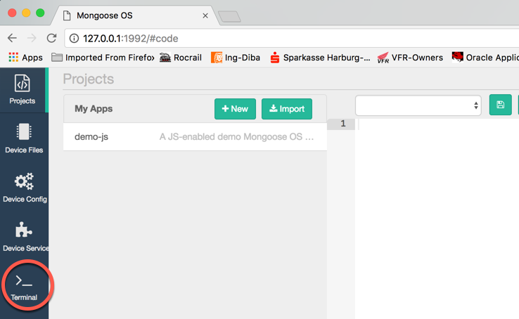

There you need to enter and run the following command
```
mos gcp-iot-setup --gcp-project YOUR_PROJECT_NAME --gcp-region europe-west1 --gcp-registry YOUR_REGISTRY
```
this will register your ESP8266 with https://cloud.google.com/iot-core/[Goolge Cloud IoT Core] and
will define the needed Environment-Variables so the ESP8266 will find the MQTT-Broker provided by https://cloud.google.com/pubsub/[Goolge Cloud PubSub]

In the log-windows of Mongoose OS, you should see lines like

```
[Dec 31 13:13:23.144] mgos_mqtt_global_con MQTT connecting to mqtt.googleapis.com:8883
[Dec 31 13:13:28.744] mgos_mqtt_ev         MQTT TCP connect ok (0)
...
[Dec 31 13:16:33.977] Published: 0 /devices/esp8266_D608CF/state -> {"hum":49.599998,"temp":25}
```

You can use the https://cloud.google.com/pubsub/[Goolge Cloud PubSub] Web-UI to verify that the MQTT messages have been received.

* navigate to your https://console.cloud.google.com/iot/[Google Cloud IoT Core] console

image::pictures/open_registry.png[]

* click on your registered device. You should only see one at the moment!

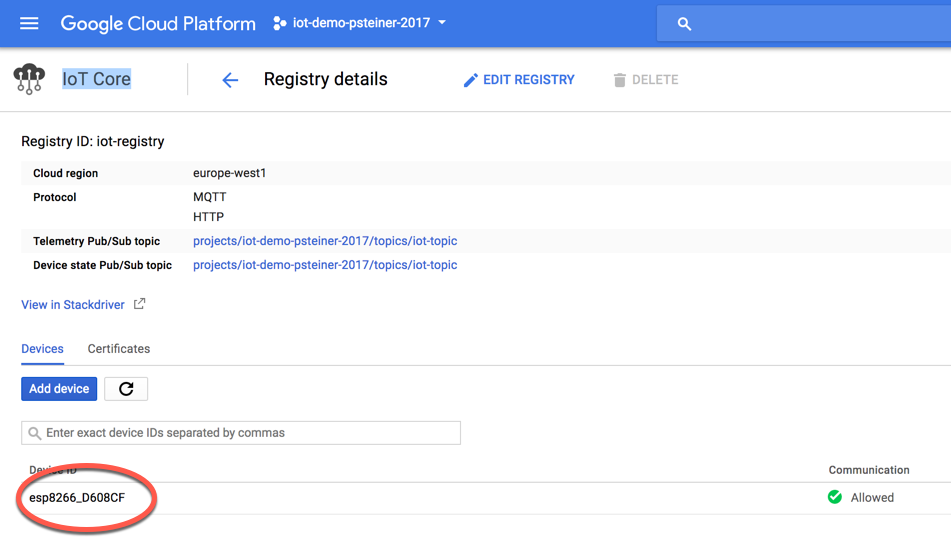

* open the tab named `Configuration & state history`

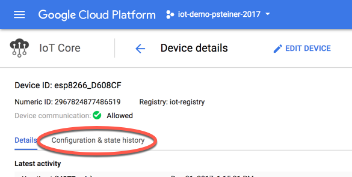

You should see a list of received messages.

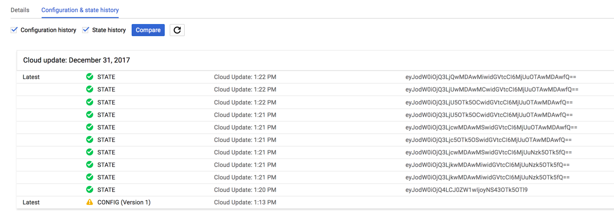

If you click on an individual message, you can see it's content in `Base64` and `Text`

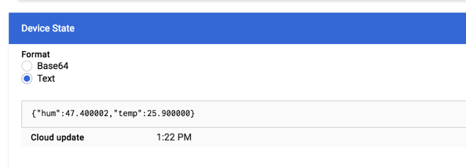

=== Write received data to file
If you followed the above steps, you should have seen data coming in via
MQTT and being displayed in the https://console.cloud.google.com/iot/[Google Cloud IoT Core] Web UI.

In the next step, we plan to take this data and write it into files. For this we
will be making use of

 * https://cloud.google.com/dataflow/[Google Cloud Dataflow]

> Cloud Dataflow is a fully-managed service for transforming and enriching data in stream (real time) and batch (historical) modes with equal reliability and expressiveness

 * https://cloud.google.com/storage/[Google Cloud Storage]

> Google Cloud Storage is unified object storage for developers and enterprises, from live data serving to data analytics/ML to data archiving.

==== Create space in Google Cloud Storage
Please follow the next steps to create space in the https://cloud.google.com/storage/[Google Cloud Storage]

* Enter the https://console.cloud.google.com/storage/[Cloud Storage Console]
* Create a new *bucket*

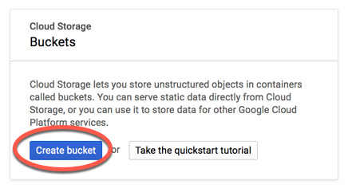

* Define the name of the *bucket*, it's storage class and the region you want
the data to be saved in.

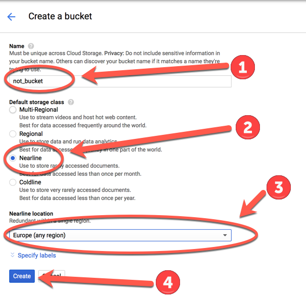


https://console.cloud.google.com/storage/
