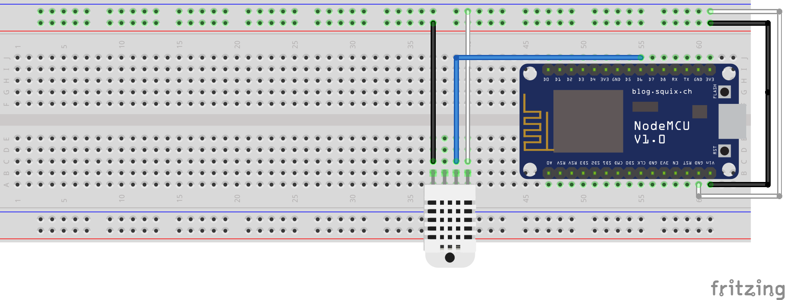
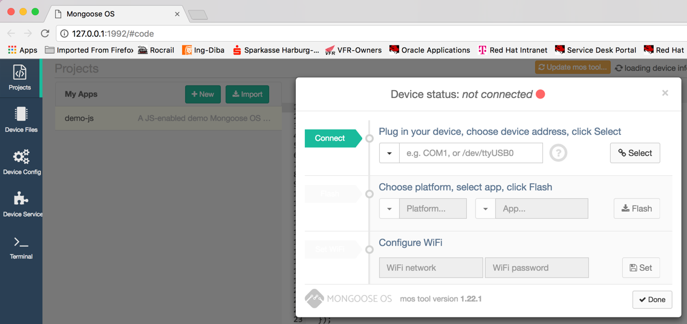
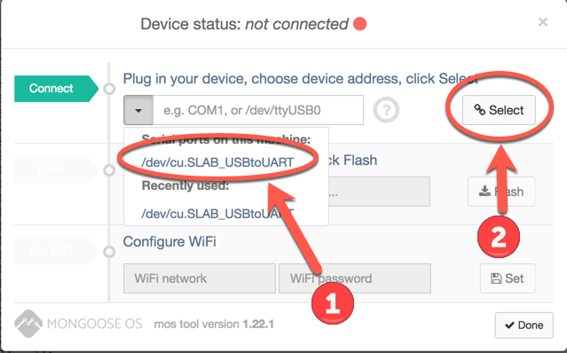
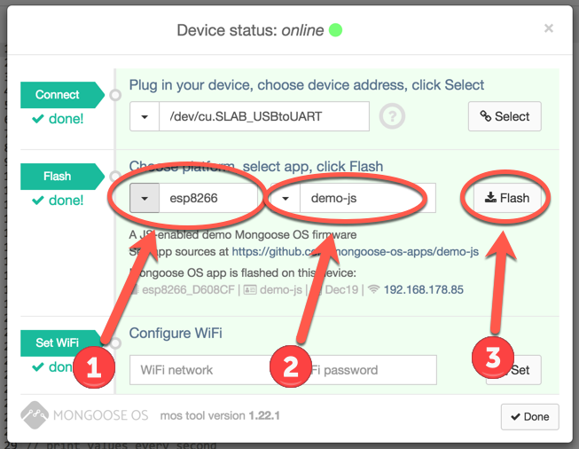
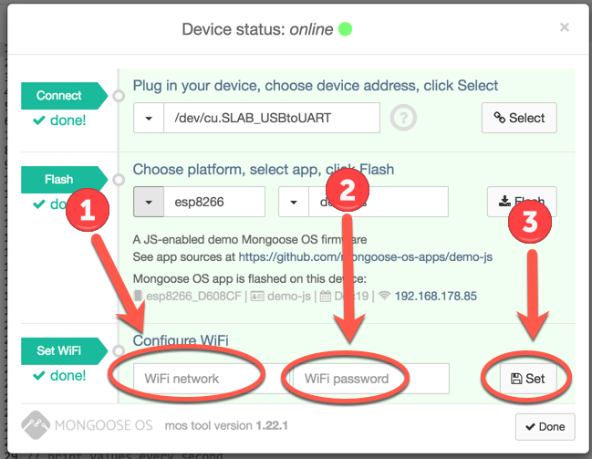

= Google Cloud Platform - IoT Demo

:Author:    Patrick Steiner
:Email:     patrick@steiner-buchholz.de
:Date:      30.12.2017

:toc: macro

toc::[]

== Purpose
In this demo we will take a look at a sample way of doing IoT like tasks,
mainly using the capabilities provided by https://cloud.google.com[Google Cloud Platform].

In this case we will make use of

 * https://cloud.google.com/iot-core/[Goolge Cloud IoT Core]
 * https://cloud.google.com/pubsub/[Goolge Cloud PubSub]
 * https://cloud.google.com/dataflow/[Goolge Cloud Dataflow]
 * https://cloud.google.com/bigquery/[Goolge BigQuery]

For the Device-Layer of this demo, we will make use of an ESP8266 microcontroller
with a DHT22 to measure temperature and humidity.

== Building a Sensor
For this demo project, I will be using a https://en.wikipedia.org/wiki/NodeMCU[NodeMCU based on ESP8266]
combined with a DHT22 sensor.

I have wired the NodeMCU and DHT22 based on the following image



To program the NodeMCU, I made use of https://mongoose-os.com/[Mongoose OS] a new system, which I was not aware of
for my previous experiments. Up to now I'm not certain of this is an advantage
to my previous method, as describe in a earlier https://github.com/PatrickSteiner/IoT_Sensor_Labs[project].
Time will tell!

[NOTE]
====
You will have to connect your NodeMCU to your computer via an USB cable.
I have seen people use some cheap USB cable that was only designed to charge
hardware and was missing the data-wires. So please make sure to use a proper
cable.
====

=== Install Mongoose OS
Please install Mongoose OS based on the description provided by https://mongoose-os.com/software.html[Mongoose OS].

=== Start Mongoose OS
Start Mongoose OS based on the instructions provided by them.

In my case I needed to run the following command from a Command-Line

```
psteiner$ ~/.mos/bin/mos
```

Your browser should start with the Mongoose OS User-Interface



=== Flash ESP8266

Select the proper Port for your NodeMCU and connect Mongoose OS with your NodeMCU.



You can flash sample code to your ESP8266. Please do so, as we will be
extending the sample code to do our bidding.



I will use the NodeJS based sample, but you can use the "C" demo as well.

Last thing to do is to connect the ESP8266 with your WiFi.


